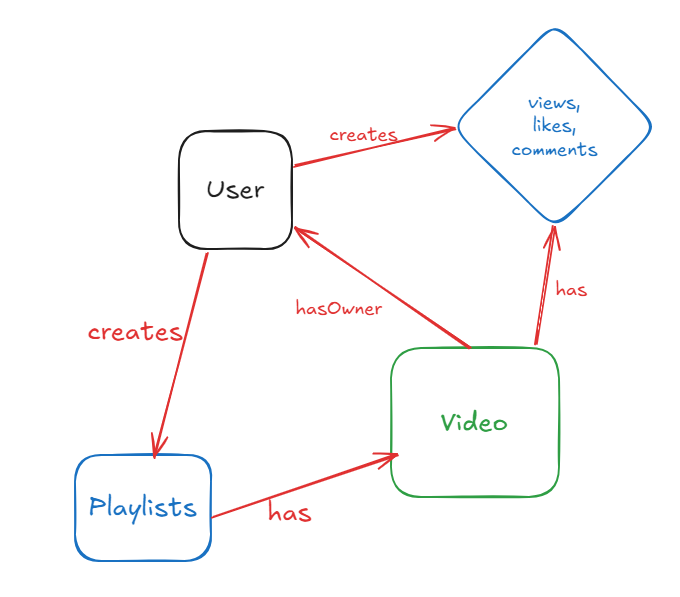

## Understanding the Data Structure**




**Video**

```javascript
interface Video {
  id: String,

  videoFile: string,
  thumbnail: string,
  owner: `User`, 
  title: string,
  description: string,
  duration: number, //duration in seconds
  views: number,
  isPublished: boolean,
  createdAt: Date,
  updatedAt: Date,
}
```

**User**

```javascript
interface User {
  id: String,

  username: string,
  email: string,
  fullName: string,
  watchHistory: array[`Video`], // Array of video IDs
  avatar: string,
  coverImage: string,
  password: string,
  refreshToken: string,
  createdAt: Date,
  updatedAt: Date,
  hasChannel: boolean,
}
```

**Playlist**

```javascript
interface Playlist {
  id: String,
  name: string,
  description: string,
  createdAt: Date,
  updatedAt: Date,
  videos: arrray[`Video`], // Array of video IDs
  owner: `User`, // User ID
}
```

**Comment**

```javascript
interface Comment {
  id: String,
  content: string,
  createdAt: Date,
  updatedAt: Date,
  video: `Video`, // Video ID
  owner: `User`, // User ID
}
```

**Like**

```javascript
interface Like {
  id: String,
  comment: number, // Comment ID
  createdAt: Date,
  updatedAt: Date,
  video: `Video`, // Video ID
  likedBy: `User`, // User ID
}
```

**Subscription**

```javascript
interface Subscription {
  id: String,
  subscriber: number, // User ID
  channel: `User`, // User ID (channel owner)
  createdAt: Date,
  updatedAt: Date,
}
```

**Note:**

- Data types for `createdAt` and `updatedAt` are to be `Date` objects.
- The `owner` field in `Video`, `Playlist`, `Comment`, and `Like` is assumed to be a reference to a `User` object by its ID.
- The `videos` field in `Playlist` and `watchHistory` in `User` are assumed to be arrays of video IDs.
- The `video` field in `Comment` and `Like` is assumed to be a reference to a `Video` object by its ID.
- The `comment` field in `Like` is assumed to be a reference to a `Comment` object by its ID.
